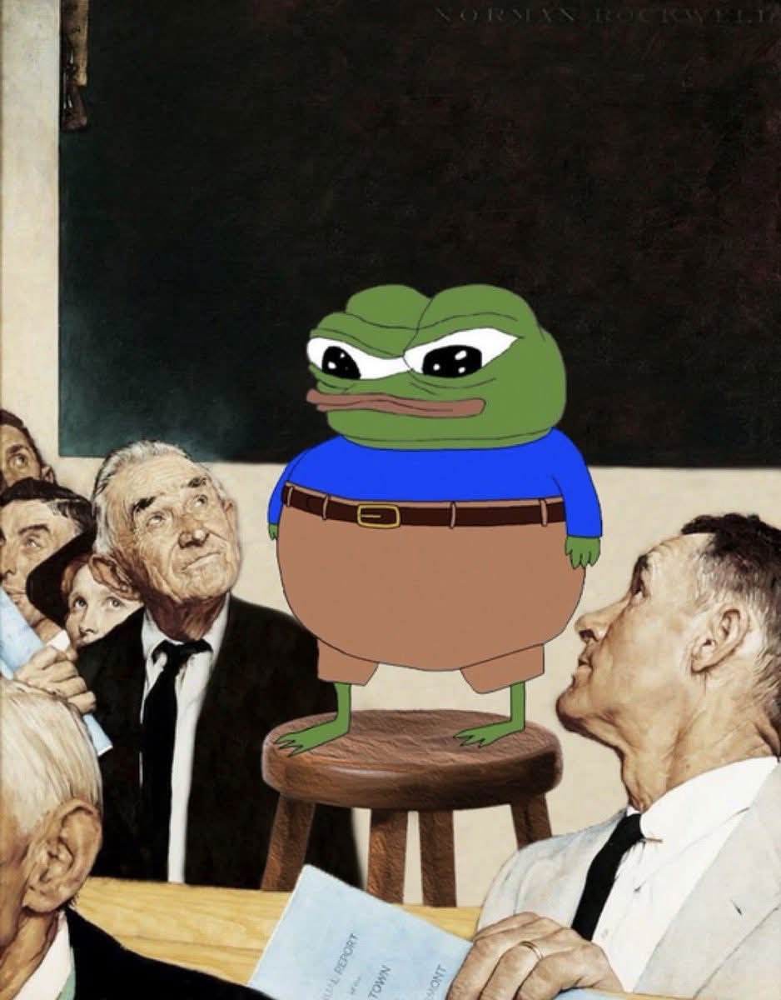
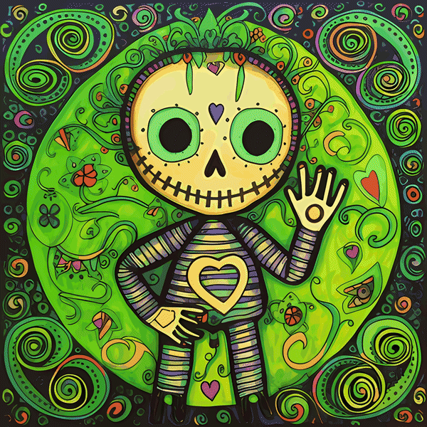
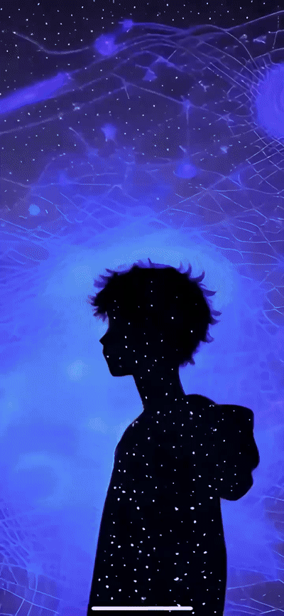

# matt culpepper // rhiza

## staff software engineer @ [wrapbook](https://wrapbook.com).

## how I work

> if you don't have time to do it right, when will you have time to do it again?

that's a great quote by John Wooden

but he didn't have 183 parallel Claude sessions to solve his problems.

## dad

brood type|name
:-----:|:-----:
teenage son|aiden
teenage daughter|molly
english lab|charli
tabby cat|boba el gato
baby siamese kitten|lotus el murciélago

## education
mississippi state alumnus. (and fan of their sports teams, unfortunately.)

president's list

made the front page of the university news after winning a computer science capture the flag exercise.

## contact
app|name
:-----:|:-----:
github|@mculp (you are here)
github org|[chunky-metro](https://github.com/chunky-metro)
discord|[chunky metro](https://discord.gg/hj9Qr5Gtmu)
twitter|[@rhizanthemum](https://twitter.com/rhizanthemum)
opensea|[new chunky metro](https://opensea.io/collection/new-chunky-metro)

## hobbies

### tech / learning / AI

ruby is the best high level language for humans and agents.

### art
AI was used as part of the workflow.

<table>
  <tr>
    <td align="center" width="50%">
       
      <i>voodoo doll</i>
    </td>
    <td align="center" width="50%">
       
      <i>consternation amongst the constellations</i>
    </td>
  </tr>
</table>

### warcraft 3

~60gb replay archive dating back to 2002 that is about to get machine learnt

### building things

### history of empires

this is a relatively new one, but I have become obsessed with ancient battles and the history of empires.

I have a channel in the works. more 🔜
