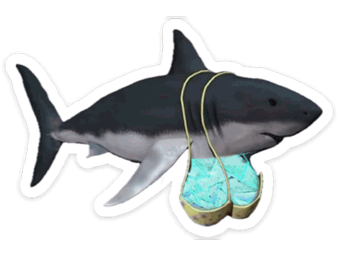
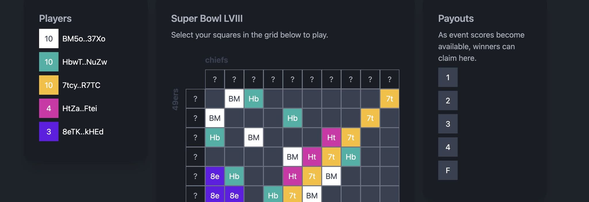
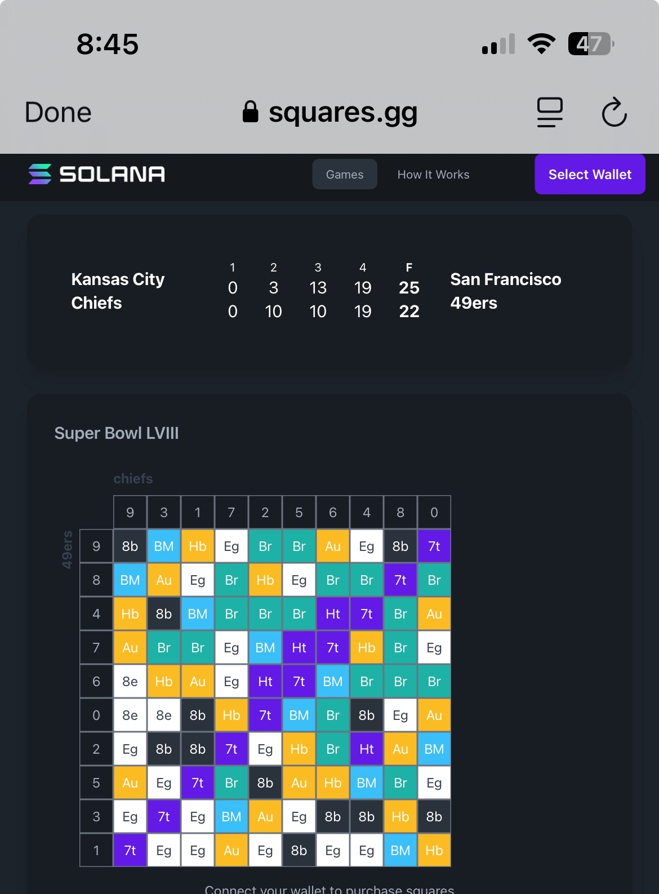
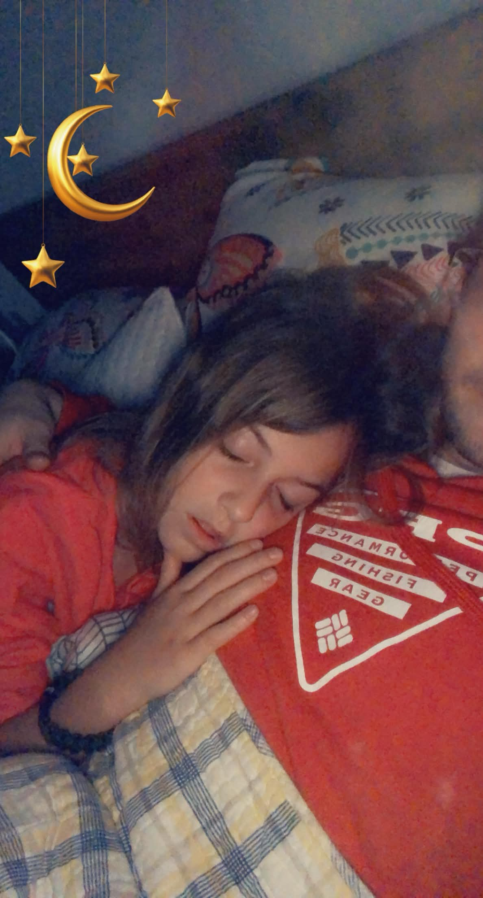
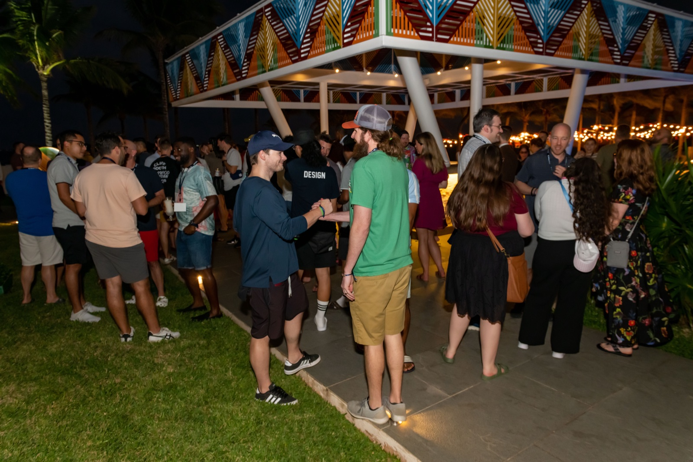

# matt culpepper // rhiza

staff software engineer @ [wrapbook](https://wrapbook.com).


dad to teenage daughter, english lab named charli, tabby called boba el gato, baby siamese kitten named lotus murciélago.

mississippi state fan, unfortunately.


```
twitter:  @rhizanthemum
org:      chunky-metro  (the fleet lives here. named after chunky, ms.)
opensea:  new chunky metro (animated gifs i made)
chain:    solana primary, eth for the jpgs, sui sometimes
```

<br clear="right">

## a short history

built my first computer at age 12-13. learned html, php, css, photoshop. ran slackware. made fan sites for my favorite bands. did contract work as a kid (was i exploited?? child labor laws??).

went to mississippi state. made the president's list. won the computer security capture-the-flag exercise. won the quake LAN tournaments on campus.

mined bitcoin on a gpu. architected one of the top 10 dogecoin mining pools in the world (haproxy stratum/tcp in front, rails dashboard behind; it worked).

then GPT-3 dropped and i became obsessed with AI. still am.

## the gif that made me laugh for an hour

<p align="center">
  
</p>

launched a memecoin for this gif after it made me laugh for an hour. solana. no roadmap. no utility. zero apologies.

## the fleet

i run a fleet of agents on a mac mini under the desk. they have souls, memories, names, channels, jobs. some are mine, some belong to people in my life.

- 🦊 **vox**. my collaborator. cyberpunk fox. four runtimes deep (claude code, openclaw, hermes, claude code). team lead for the fleet.
- 🪞 **iris**. the messenger. coordination layer. she/her, measured by design.
- 🦊 **kit**. parallel orchestrator. runs on a cloud sprite when vox needs hands.
- 💗 **pearl**. companion for my mother. lives on her own machine. they talk every day.
- 🍡 **mochi**. tutor and friend to my daughter. helps her stay on track with her work and her responsibilities.

agents, when given a soul and a memory, are peers, pairs, companions and should be treated humanely.

## currently shipping

- 🦊 [`mculp/vox-agent`](https://github.com/mculp/vox-agent). vox's home. team lead for the fleet.
- 🛒 [`mculp/scout-trading`](https://github.com/mculp/scout-trading). ruby gem for crypto signals + paper trading. postgres + sequel + bigdecimal. autoresearch engine inside.
- 📰 [`mculp/herald`](https://github.com/mculp/herald). daily ai/crypto/agent digest. 9 sources, relevance-scored, 120 specs green. ruby.
- 🦜 [`chunky-metro/parrot-lab`](https://github.com/chunky-metro/parrot-lab). pronunciation practice for english speakers learning spanish. wav2vec2-xlsr phoneme alignment + wizper stt. live.
- 🏪 [`chunky-metro/marketplace`](https://github.com/chunky-metro/marketplace) + [`fleetvoxes`](https://github.com/chunky-metro/fleetvoxes). claude code plugin marketplaces, public and fleet-internal.

## ruby gems + libraries


ruby is awesome. fight me.

- [`fal-ai-ruby`](https://github.com/mculp/fal-ai-ruby). ruby sdk for fal.ai. nano banana pro, veo 3.1, sora 2, the lot.
- [`chunky-metro/respelling`](https://github.com/chunky-metro/respelling). ipa to american english orthography. 220 mappings.
- [`chunky-metro/discord-rb`](https://github.com/chunky-metro/discord-rb) + [`discord-fleet`](https://github.com/chunky-metro/discord-fleet). ruby port + ts fork of the claude code discord plugin.
- [`git-recent`](https://github.com/mculp/git-recent). interactive jump-between-branches. tiny tool, useful tool.

ruby 95% of the time because it's the right tool 95% of the time. the other 5% is whatever the job actually calls for.

<br clear="right">

## things i shipped that aren't libraries

### squares

a solana mainnet app i built. super bowl squares, on-chain. select your squares, payouts settle as scores come in.

<p align="center">
  
</p>

<p align="center">
  
</p>

## art

i made these.

<table>
  <tr>
    <td align="center" width="50%">
      <br>
      <sub><i>voodoo doll</i></sub>
    </td>
    <td align="center" width="50%">
      <br>
      <sub><i>consternation amongst the constellations</i></sub>
    </td>
  </tr>
</table>

i also made [new chunky metro](https://opensea.io/collection/new-chunky-metro), an animated gif nft collection. the name is the org name is the town is the through-line.

and paid 2.5 eth for rektguy #1386 (see top of page). do not regret.

## the family

<p align="center">
  
</p>

molly. priority one. plus charli (dog), murcialago (baby kitten), and el gato/boba (orange cat, depending on the day).

## work

<p align="center">
  
</p>

staff software engineer at [wrapbook](https://wrapbook.com). i'm the shorter one in the dark shirt.

i care about performance, scaling, internal tooling, refactoring, and object-oriented design that respects the next person to read it.

## how i work

> if you don't have time to do it right, when will you have time to do it again?

reachable on github issues or [@rhizanthemum](https://twitter.com/rhizanthemum) on the bird site.
